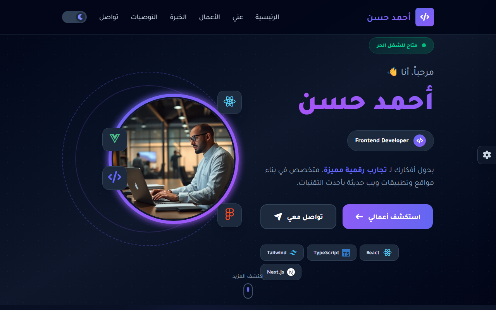

# Interactive RTL Portfolio Template
**An interactive, responsive Arabic portfolio template with real-time UI customization and dynamic JavaScript controls.**

**[Live Demo](https://shalabycode.dev/Assignment_10_Applying_logic_to_portfolio/)** · **[Source](https://github.com/Shalabyelectronics/Assignment_10_Applying_logic_to_portfolio)**



## About
This project is an interactive, right-to-left (RTL) personal portfolio website developed as part of Route Academy's frontend track (Assignment 10). The goal was to take a static Arabic portfolio template and implement complete vanilla JavaScript client-side logic—including navigation tracking, interactive UI personalization, animated portfolio filtering, and a responsive carousel. Note that the profile content featured on the page ("Ahmed Hassan") represents assignment mockup data rather than the author.

## Features
- **RTL / Arabic UI**: Built with native right-to-left flow and Arabic typography support.
- **Theme Customization Sidebar**: Off-canvas settings panel allowing users to switch primary/secondary brand accent colors dynamically using CSS custom properties.
- **Font Switcher**: Dynamic typography toggle supporting Alexandria, Cairo, and Tajawal font families.
- **Dark and Light Mode**: Theme toggle that switches root color schemes and updates toggle icons.
- **Settings Persistence**: Saves dark/light mode state, font choice, and chosen theme colors to `localStorage` across sessions.
- **ScrollSpy Navigation**: Highlights the active navigation menu item dynamically based on the current scroll position and section offsets.
- **Project Category Filtering**: Filters portfolio cards by category tags with scale and opacity animations.
- **Custom Testimonial Carousel**: Responsive multi-item slider with calculated item widths, dynamic indicator dots, and window resize recalibration.

## Built With
- Vanilla JavaScript (ES6+)
- HTML5 (Semantic RTL markup, ARIA roles)
- Tailwind CSS v4
- Font Awesome
- Google Fonts (Alexandria, Cairo, Tajawal)

## What I Learned
- Implemented a custom ScrollSpy algorithm by comparing `window.scrollY` against DOM element `offsetTop` and `offsetHeight` values with fixed header offset compensation.
- Managed dynamic CSS custom properties programmatically via `document.documentElement.style.setProperty()` to change theme colors on the fly.
- Built a zero-dependency carousel calculating slide bounds with `getBoundingClientRect()` and synchronizing dynamic indicator tabs.
- Utilized `localStorage` to synchronize and persist user interface preferences across browser reloads.

## Getting Started
To view and run the project locally:

1. Clone the repository:
   ```bash
   git clone https://github.com/Shalabyelectronics/Assignment_10_Applying_logic_to_portfolio.git
   ```
2. Navigate into the project directory:
   ```bash
   cd Assignment_10_Applying_logic_to_portfolio
   ```
3. Open `index.html` in your web browser or serve it using the VS Code Live Server extension.

## Project Structure
```
Assignment_10_Applying_logic_to_portfolio/
├── css/
│   └── style.css
├── docs/
│   └── screenshot.png
├── imgs/
├── js/
│   └── index.js
└── index.html
```

## Roadmap
- [ ] Add touch swipe gesture support for the testimonials carousel on mobile devices
- [ ] Add client-side validation and feedback states for the contact form
- [ ] Enhance mobile hamburger menu toggle animation

## Author
**Mohamed Shalaby**
- Website: [shalabycode.dev](https://shalabycode.dev)
- GitHub: [@Shalabyelectronics](https://github.com/Shalabyelectronics)
- LinkedIn: [mhdshalaby](https://www.linkedin.com/in/mhdshalaby/)
